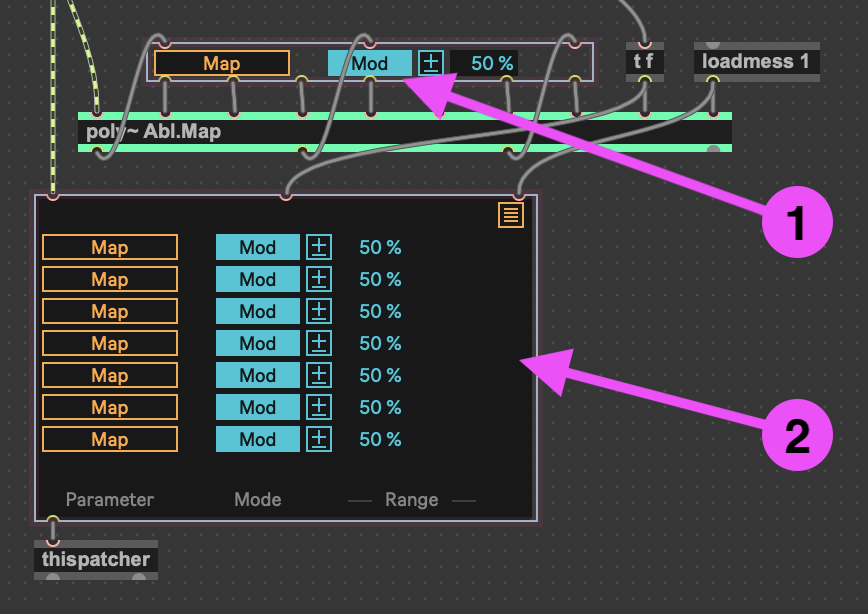

# m4l-mapper
Reusable, simplified multi-mapping bpatcher for Max for Live devices

## Installation / Use

### Download / Install
Check the [Releases](https://github.com/zsteinkamp/m4l-zs.mapper/releases) page for the latest release in downloadable .zip form.

You can also use `git` to clone the repository.

In either case, extract the files to a directory inside of the `~/Documents/Max 8/Packages/` directory, which by default is in Max's search path.

### Usage in Your Devices

* Create a `[bpatcher zs.MultiMap]` object
* Set its Scripting Name to `multimap`
* Check "Include in Presentation"
* Set the Presentation Rectangle to `2. 4. 251. 18.`
* Right-click the object and choose "Bring to Front"
* Attach a signal to the left inlet
* ...
* Profit!

Note that the object will manage the position of the Expand/Collapse button. It may not look like it is positioned correctly if you change the width of the `[bpatcher]`, but once you save the device and return to Live it will be positioned correctly.

## Reason for Living

### The Problem
The multimapper component that comes with Live 12 is a great improvement over what was in the prior version, with CPU usage reduction and support for the new modulation mode.

However, integrating it into a Max for Live device is more complex than it needs to be. 

Here is the multi-mapper impelementation in the Live 12's stock LFO device:

There is a single mapper `[bpatcher]` [1] that is always visible, and must be placed "in front" of the large `[bpatcher]` [2], since it sits in the empty row above the seven other modulation mappers in presentation. The large `[bpatcher]` must be second in the z-order of the presentation of the device so that it may cover the other UI elements of the device when expanded, but not hide the one in the top row.

There are a total of six objects and 18 patch cords in this implementation.

### The Improvement
There is an opportunity to simplify the design of this component by having the large `[bpatcher]` host all eight mappers.

There are now only two objects and two patch cords required in the device - the input signal, and a connection to `[thispatcher]` so that the `[bpatcher]` can expand vertically when required. This `[bpatcher]` can sit in front of all other objects, eliminating the need to maintain a "second in order". 

## Acknowledgments
Thanks to the Ableton / Cycling 74 teams for improving the mapper for better CPU utilization through the creative use of `[poly~]`, as well as keeping the stock devices editable so that people like me may learn from them!
